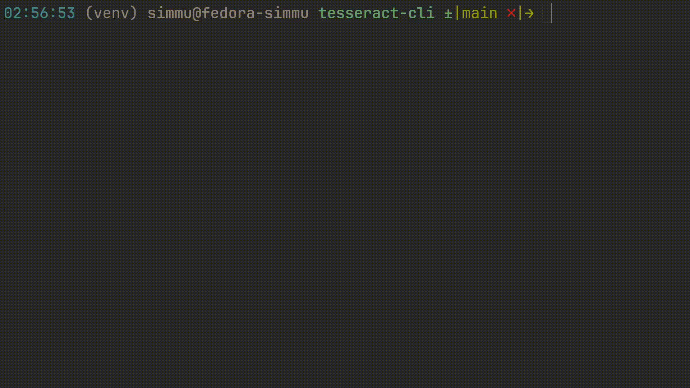

# Tesseract-CLI

Tesseract-CLI is a command-line application designed to download and bundle PDFs according to units.

## Demo (WIP)


## Features

- Download PDFs based on URLs.
- Bundle multiple PDFs into a single merged PDF.
- Uses Selenium Wire to capture and inspect network requests.
- Still in development, features may change over time.

## Installation

To install and run Tesseract-CLI, follow the steps below:

### 1. Clone the repository
First, clone the repository to your local machine:

```bash
git clone https://github.com/yourusername/tesseract-cli.git
cd tesseract-cli
```

### 2. Setup Virtual Environment
```bash
python3 -m venv venv
source venv/bin/activate   # For Linux/macOS
venv\Scripts\activate      # For Windows
```

### 3. Install Dependencies
```bash
pip install -r requirements.txt
```

### 4. Run the Application
```bash
python main.py
```

## Requirements
- Python 3.x
- Required dependencies are listed in requirements.txt:
    - selenium-wire
    - requests
    - yaspin
    - pypdf
    - chromedriver-autoinstaller
    - inquirer